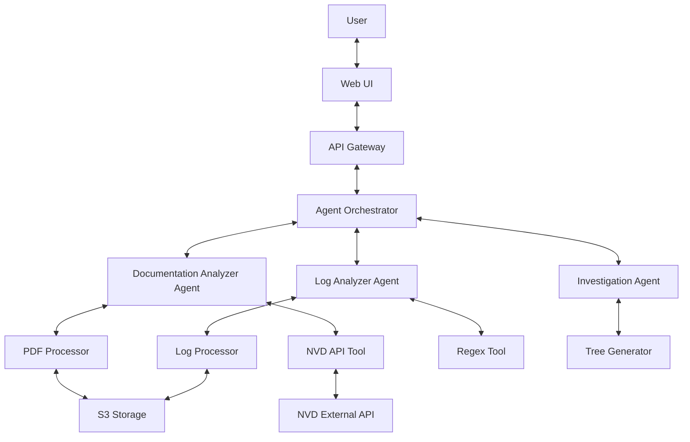
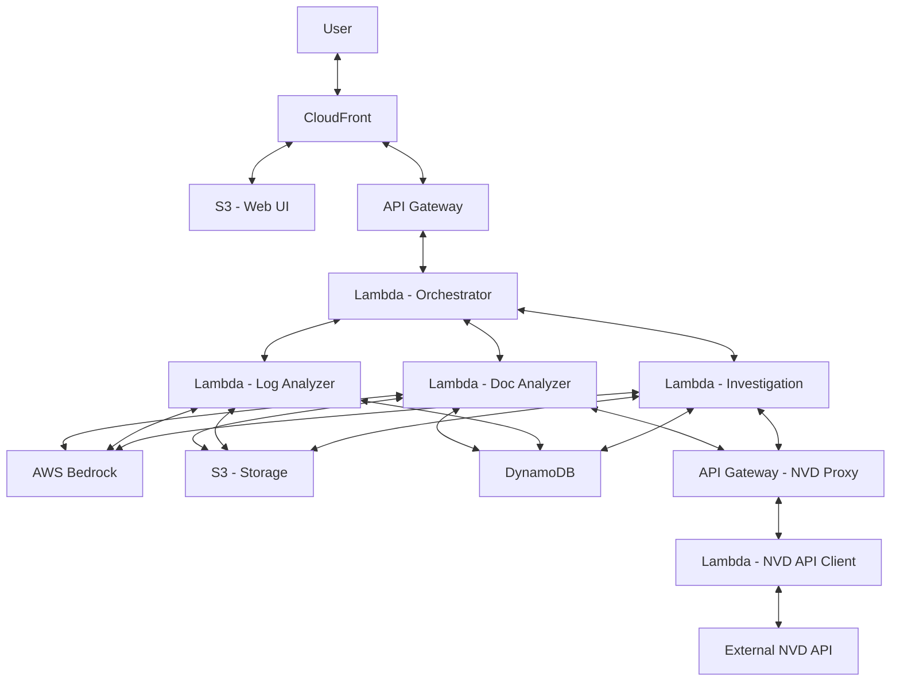
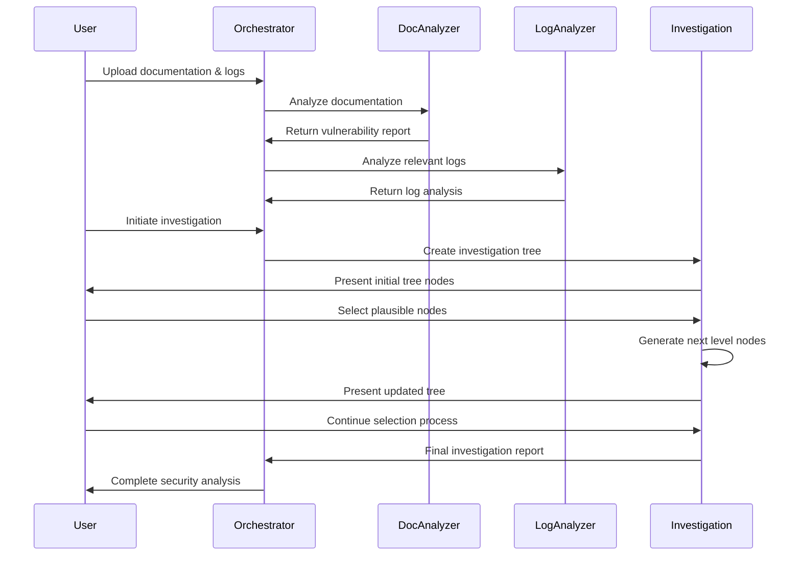
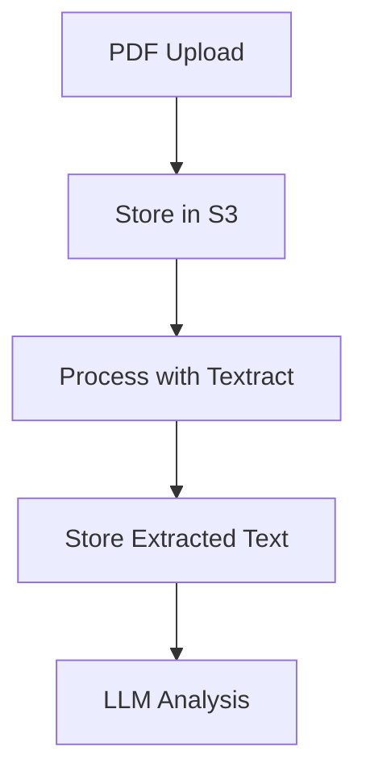
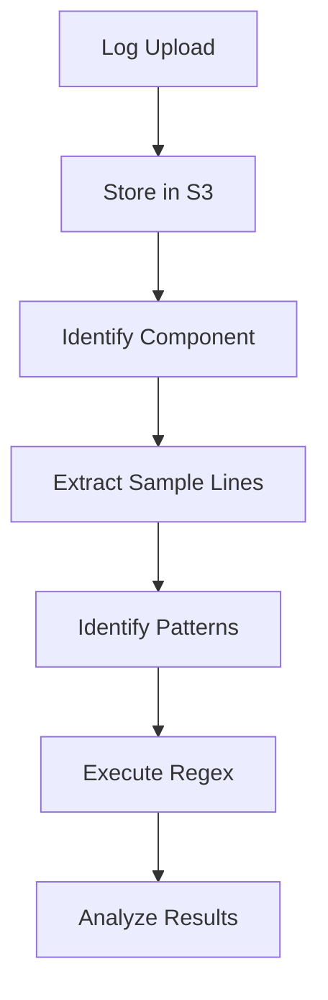
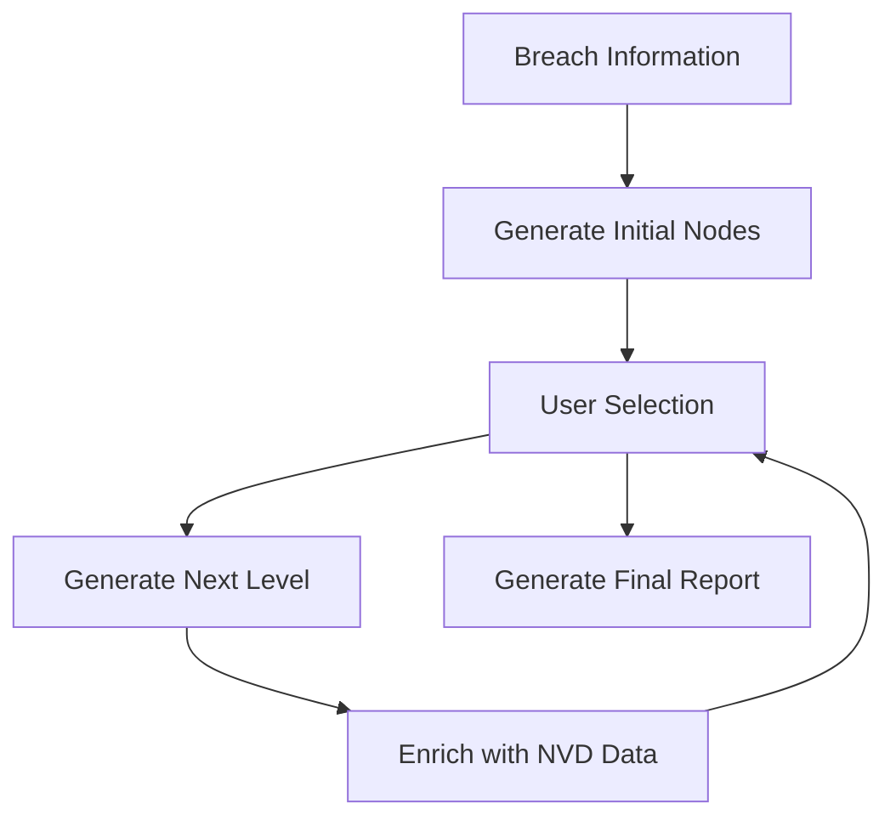
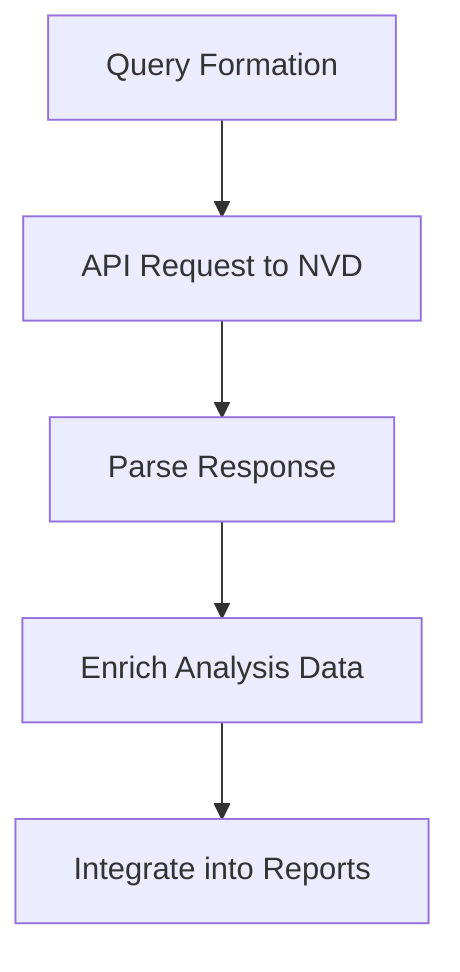

# Sherlock: Agentic Security Analysis System

## Project Overview

Sherlock is an agentic AI system built on AWS Bedrock that analyzes system documentation and logs to identify security vulnerabilities, investigate potential breaches, and provide actionable security insights. The system leverages multiple specialized AI agents working together to perform comprehensive security analysis.

## System Architecture

### High-Level Architecture

### AWS Integration Architecture

## Agentic Design

### Agent Roles and Responsibilities

#### 1. Orchestrator Agent

**Role**: Coordinates the activities of all specialized agents and manages the overall workflow.

**Tools**:
- Agent Communication Manager
- Task Scheduler
- State Manager

**Inputs**:
- User requests
- System documentation (PDF)
- Log files
- Agent outputs

**Outputs**:
- Coordinated agent responses
- Overall system state

#### 2. Documentation Analyzer Agent

**Role**: Analyzes system documentation to identify potential security weakpoints and vulnerabilities.

**Tools**:
- PDF Text Extractor
- NVD API Client
- Vulnerability Analyzer
- Report Generator

**Inputs**:
- System documentation (PDF)
- NVD API responses

**Outputs**:
- Vulnerability analysis report (Markdown)
- Identified system components
- Potential security weakpoints

#### 3. Log Analyzer Agent

**Role**: Analyzes system logs to identify anomalies and potential security issues.

**Tools**:
- Log Parser
- Regex Pattern Matcher
- Component Identifier

**Inputs**:
- System logs from ./logs directory
- System component information from Documentation Analyzer

**Outputs**:
- Log analysis results
- Identified anomalies
- Relevant log entries

#### 4. Investigation Agent

**Role**: Creates and manages the investigation tree for breach analysis.

**Tools**:
- Tree Generator
- NVD API Client
- Hypothesis Generator
- Tree Visualizer

**Inputs**:
- Initial breach information
- User feedback on plausible nodes
- NVD API responses
- Information from other agents

**Outputs**:
- Interactive investigation tree
- Breach analysis report

### Agent Interaction Flow

## Technical Components

### 1. PDF Processing Pipeline

### 2. Log Analysis Pipeline

### 3. Investigation Tree Generation

### 4. NVD API Integration

## UI Framework Selection

For a hackathon with a need for a visually appealing UI that can be quickly implemented and is well-known by LLMs, I recommend **React** with **AWS Amplify** and **Material-UI (MUI)** for the following reasons:

1. **React** is widely used and well-documented, making it easy to get help from LLMs during development
2. **AWS Amplify** provides seamless integration with AWS services and simplifies authentication, API integration, and deployment
3. **Material-UI (MUI)** offers beautiful, pre-designed components that can be quickly assembled into a professional-looking interface
4. This combination allows for rapid development while still producing a visually impressive result for the demo/pitch

For the interactive tree visualization specifically, I recommend using **react-d3-tree** or **react-orgchart** libraries, which provide ready-to-use interactive tree visualizations that can be easily customized.

## Implementation Roadmap

### Phase 1: Setup & Infrastructure (Day 1 - Morning)

1. Set up GitHub repository with proper structure
2. Initialize AWS resources:
   - S3 buckets for storage
   - Lambda functions for each agent
   - API Gateway for endpoints
   - DynamoDB for state management
   - Bedrock model access
3. Set up React application with AWS Amplify
4. Configure CI/CD pipeline

### Phase 2: Core Agent Implementation (Day 1 - Afternoon)

1. Implement PDF processing pipeline
2. Implement NVD API integration
3. Implement basic agent communication
4. Set up log analysis framework

### Phase 3: UI Development (Day 1 - Evening)

1. Implement main dashboard UI
2. Create file upload components
3. Implement report viewing components
4. Set up basic navigation

### Phase 4: Investigation Tree Implementation (Day 2 - Morning)

1. Implement tree data structure
2. Create tree visualization component
3. Implement node generation logic
4. Set up user interaction handlers

### Phase 5: Integration & Testing (Day 2 - Afternoon)

1. Integrate all components
2. Test end-to-end workflows
3. Fix bugs and optimize performance
4. Prepare demo data

### Phase 6: Finalization & Presentation Prep (Day 2 - Evening)

1. Polish UI and user experience
2. Create demonstration script
3. Prepare PowerPoint presentation
4. Document code and update GitHub repository

## AWS Bedrock Model Selection

For optimal performance across different components, we recommend the following AWS Bedrock models:

1. **Documentation Analysis**: Claude 3 Opus
   - Reasoning: Best for complex document understanding and detailed analysis
   - Use case: Analyzing system documentation to identify vulnerabilities

2. **Log Analysis**: Claude 3 Sonnet
   - Reasoning: Good balance of performance and cost for pattern recognition
   - Use case: Analyzing log files and identifying relevant components

3. **Investigation Tree Generation**: Claude 3 Opus
   - Reasoning: Superior reasoning capabilities for generating plausible attack paths
   - Use case: Creating the investigation tree and generating hypotheses

4. **User Interaction**: Claude 3 Haiku
   - Reasoning: Fast response times for interactive elements
   - Use case: Handling user queries and providing explanations

## Technical Considerations

### 1. Performance Optimization

- Implement caching for NVD API responses
- Use AWS Lambda provisioned concurrency for critical functions
- Optimize PDF processing for large documents
- Implement pagination for large log files

### 2. Security Considerations

- Implement proper IAM roles and permissions
- Encrypt sensitive data at rest and in transit
- Validate all user inputs
- Implement rate limiting for API endpoints

### 3. Scalability

- Design for horizontal scaling of Lambda functions
- Use DynamoDB for scalable state management
- Implement efficient S3 storage patterns
- Design UI components to handle varying amounts of data

### 4. Hackathon Success Factors

- Focus on visual impact for the demo
- Prepare compelling examples that showcase the system's capabilities
- Ensure smooth transitions between components during the presentation
- Highlight AWS integration points in the presentation

## Conclusion

The Sherlock system architecture provides a comprehensive approach to security analysis using agentic AI powered by AWS Bedrock. By leveraging multiple specialized agents, the system can analyze documentation, logs, and create investigation trees to provide valuable security insights.

The implementation roadmap is designed for rapid development in a hackathon environment, with a focus on creating a visually impressive and functional prototype that showcases the integration of AWS services and AI capabilities.